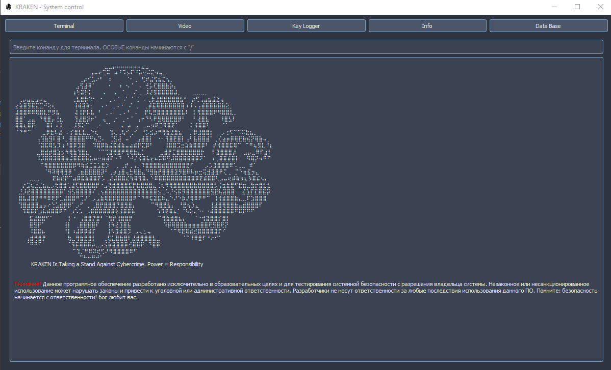

# Start Guide 
1. Запускаем файл build.py (Для сборки нужного файла)
2. запускаем app/main.py -> main - основной интерфейс / Enter - запустить со стартового интерфейса


---
---

## Main terminal


**Команды:**
- <u>/help</u> - Список команд
- <u>/con_info</u> - Состояние подключения
- <u>/connect</u> - Запуск сервера
- <u>/disconnect</u> - Отключение сервера
- <u>/terminal -A</u> - Запуск админ терминала
- <u>/colorface</u> - Интерфейс настройки цвета
- <u>/bible</u> - ?

---
---

## Задачи:
**Frontend**
- [x] Команда /support - информация о создателях и поддержке
- [x] Добавление в БД созданных клиентов (Start)
- [x] Везде задать функцию и отображение иконки
- [ ] Создать интерфейс для Video
- [ ] Настроить дебаг лог консоль
- [ ] Создать систему ключей по временным использованием
    - [ ] Создать и автоматизировать бд для ключей 
- [ ] Организовать поиск текста в keylogger
- [ ] Обновить интерфейс
    - [ ] Обновить бд и добавить новые пункты(информация, местоположение и т.д)
    - [ ] Добавить функцию /build для сборки клиентов
- [ ] Подключение к клиенту по имени
    - [ ] Создать проверку что имя введено без пробелов
    - [ ] Определять введено имя или ip + port
    - [ ] Брать ip + port по имени из db
- [ ] Создать выбор приложения при сборке клиента(Слайдер)
    - [ ] Попробовать сделать так чтобы python client добавлялся в выбранный exe
- [ ] Убрать полностью стартовый интерфейс 
- [ ] Переписать код и справить все пути под exe(Импорты)(не работают utils файлы)


**Backend**
- [ ] Доделать отображение информации о "поклоннике"
    - [ ] Изменить команду на "systeminfo" - больше информации
- [ ] Связать переменную кей логгера с сервером
    - [ ] Получение нажатий клиента
    - [ ] Отправка сохранённых нажатий на сервер каждые 5 секунд + очистка переменной
    - [ ] Принятие текста сервером и записываем(добавляя) в переменную
- [ ] Настроить получение фото
    - [ ] Интерфейс с кнопкой(Запустить/Отключить)
    - [ ] Прямая передача экрана по флагу


**General**
- [x] Упаковать приложение в .exe файл
- [x] Перенести проект на PyQt6
- [x] Настроить взаимодействие с БД в exe файле
- [x] Исправить ошибку в exe(Не запускается окно main)
- [ ] Создание ТГ бота(Aiogram)
- [ ] Создать упаковку в exe клиентской части
- [ ] Создание документации по работе с программой


---
---
### Использование удалённого терминала
**Основные полезные команды**
- <u>dir</u> - Показывает список файлов и папок в текущей директории.
- <u>cd <Имя_директории></u> - перейти в папку/файл по заданному пути.
- <u>dir <Имя_файла></u> - Поиск файла в текущей директории(dir *.txt)
- <u>type <имя_файла></u> - Показывает содержимое текстового файла.
- <u>more <имя_файла></u> - Показывает содержимое файла постранично.


## Для разработчиков
Для подготовки и упаковки .exe файла используем команду в Bash
```
pyinstaller KRAKEN.spec
```
После упаковки готовый файл лежит в файле <u>dict</u>